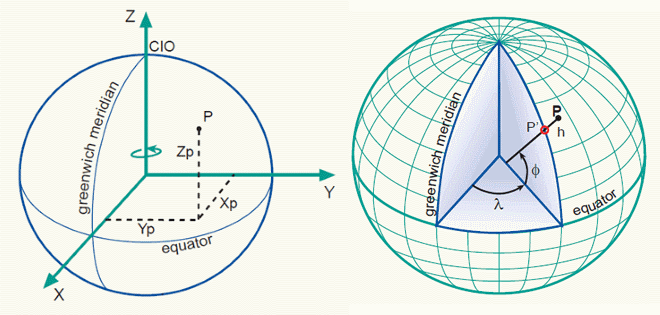

## Geo Coordinate Converter http://geocoordinateconverter.tk
For English version of this file see [README.md].

**gk-slo** je konverter med geografskimi kartezičnimi koordinatami
(Gauss-Krueger/D48, Transverzalni Merkator/D96) in geodetskimi koordinatami
(širina/dolžina na ETRS89/WGS84) za Slovenijo. Lahko se ga uporabi kot
nadomestilo za uradni program za konverzijo [SiTra] &#40;s Helmertovimi
parametri za vso Slovenijo, brez regionalnih parametrov&#41; ali natančnejši,
če se uporabi vgrajena afina/trikotniška transformacija z referenčnimi
[virtualnimi veznimi točkami v3.0] &#40;za natančen opis glej [AFT.md]&#41;.



Program lahko bere datoteke v formatu [SiTraNet] &#40;ASCII XYZ), [LIDAR]
&#40;ASCII XYZ s podpičjem, .asc) ali [ESRI shapefile] &#40;ArcGIS .shp
format, uporabi **gk-shp**).

Na razpolago so naslednje transformacije (v obe smeri):

1. xy (D96/TM) **&#8660;** &phi;&lambda; (ETRS89)
2. xy (D48/GK) **&#8660;** xy (D96/TM) &nbsp;&nbsp;&nbsp;&nbsp;Helmertova transformacija
3. xy (D48/GK) **&#8660;** &phi;&lambda; (ETRS89) &nbsp;&nbsp;&nbsp;Helmertova transformacija
4. xy (D48/GK) **&#8660;** xy (D96/TM) &nbsp;&nbsp;&nbsp;&nbsp;Afina transformacija
5. xy (D48/GK) **&#8660;** &phi;&lambda; (ETRS89) &nbsp;&nbsp;&nbsp;Afina transformacija

Pri računanju višin s pomočjo modela geoida sta na razpolago dva absolutna
modela geoida za Slovenijo: Slo2000 in [EGM2008].

Napisan je v jeziku C in se ga da prevesti in uporabljati na vseh pomembnejših
operacijskih sistemih. Podprogrami za konverzijo koordinat se lahko enostavno
priredijo za uporabo tudi na drugih lokacijah, ne samo v Sloveniji (preko
definicij elipsoida ter projekcijskih in Helmertovih parametrov).

Natančnejši opis podprogramov za konverzijo koordinat in njihov API
(v modulu "geo.c") je v datoteki [geo_api.md].

Spisek uporabljene literature (s povezavami do dokumentov) je v datoteki
[literature.md].

Prevedeno verzijo **gk-slo/gk-shp za Windows** (32-bitna, prevedena z MinGW)
lahko dobite na [gk-slo-8.02.zip].


### Oznake
Kartezične koordinate                 | Geodetske koordinate
:------------------------------------ |:--------------------
x = easting                           | fi = phi (&phi;), širina (S/J)
y = northing                          | la = lambda (&lambda;), dolžina (V/Z)
H = ortometrična/nadmorska višina     | h = elipsoidna višina
Ng = geoidna višina


### Datoteke
- **[common.h]**  
  Datoteka s skupnimi definicijami za okolji Windows in Unix
- **[util.c]**  
  Zbirka skupnih funkcij za uporabo v ostalih delih programa
- **[geoid_slo.h]**  
  Absolutni model geoida za Slovenijo iz GURS (Slo2000)
- **[geoid_egm.h]**  
  Absolutni model geoida za Slovenijo iz [EGM2008]
- **[aft_gktm.h]**, **[aft_tmgk.h]**  
  Vnaprej izračunane tabele za trikotniško transformacijo za Slovenijo
- **[geo.h]**  
  Datoteka z definicijami za podprograme za konverzijo koordinat
- **[geo.c]**  
  Zbirka podprogramov za konverzijo koordinat
- **[gk-slo.c]**  
  Glavni program za konverzijo koordinat iz XYZ datotek
- **[gk-shp.c]**  
  Glavni program za konverzijo koordinat iz shapefile datotek
- **[shapelib]**  
  Datoteke iz [Shapefile C Library], potrebne za branje in pisanje ESRI
  Shapefile datotek


### Kako prevesti program
#### Unix
```$ cc -O2 -Wall -msse2 -mfpmath=sse gk-slo.c util.c geo.c -o gk-slo -lm -lrt```  
```$ cc -O2 -Wall -msse2 -mfpmath=sse -Ishapelib gk-shp.c util.c geo.c \ ```  
&nbsp;&nbsp;&nbsp;```shapelib\shpopen.c shapelib\dbfopen.c shapelib\safileio.c shapelib\shptree.c -o gk-shp -lm -rt```  
ali  
```$ make -f Makefile.unix```
#### MinGW na Windows
```$ gcc -O2 -Wall -msse2 -mfpmath=sse -D_WCHAR gk-slo.c util.c geo.c -o gk-slo.exe```  
```$ gcc -O2 -Wall -msse2 -mfpmath=sse -Ishapelib gk-shp.c util.c geo.c \ ```  
&nbsp;&nbsp;&nbsp;```shapelib\shpopen.c shapelib\dbfopen.c shapelib\safileio.c shapelib\shptree.c -o gk-shp.exe```  
ali  
```$ make -f Makefile.mingw```
#### Microsoft C
```$ cl /O2 /Wall -D_WCHAR gk-slo.c util.c geo.c```  
```$ cl /O2 /Wall /Ishapelib gk-shp.c util.c geo.c \ ```  
&nbsp;&nbsp;&nbsp;```shapelib\shpopen.c shapelib\dbfopen.c shapelib\safileio.c shapelib\shptree.c```  
ali  
```$ nmake -f Makefile.msc```

Opciji ```-msse2 -mfpmath=sse``` sta potrebni, ker drugače dobimo različne
rezultate na različnih sistemih (za podrobnejšo razlago glej [StackOverflow]).


### Uporaba
<pre>
$ gk-slo [&lt;opcije&gt;] [&lt;vhodime&gt; ...]
  -d                omogoči debug izpis
  -ht               izračunaj izhodno višino s 7-param. Helmertovo trans.
  -hc               kopiraj vhodno višino nespremenjeno na izhod
  -hg               izračunaj izhodno višino s pomočjo modela geoida (privzeto)
  -g slo|egm        izberi model geoida (Slo2000 ali EGM2008)
                    privzeto: Slo2000
  -dms              prikaži fila v SMS formatu za višino
  -t &lt;n&gt;            izberi transformacijo:
                     1: xy   (d96tm)  --&gt; fila (etrs89), hg?, privzeto
                     2: fila (etrs89) --&gt; xy   (d96tm),  hg
                     3: xy   (d48gk)  --&gt; fila (etrs89), ht
                     4: fila (etrs89) --&gt; xy   (d48gk),  hg
                     5: xy   (d48gk)  --&gt; xy   (d96tm),  hg(hc)
                     6: xy   (d96tm)  --&gt; xy   (d48gk),  ht(hc)
                     7: xy   (d48gk)  --&gt; xy   (d96tm),  hc, affine trans.
                     8: xy   (d96tm)  --&gt; xy   (d48gk),  hc, affine trans.
                     9: xy   (d48gk)  --&gt; fila (etrs89), hg, affine trans.
                    10: fila (etrs89) --&gt; xy   (d48gk),  hg, affine trans.
  -r                obrni vrstni red branja xy/fila
                    (opozorilo se izpiše če je y &lt; 200000 ali la &gt; 17.0)
  &lt;vhodime&gt;         preberi in konvertiraj vhodne podatke iz datoteke &lt;vhodime&gt;
                    &lt;vhodime&gt; "-" pomeni stdin, prej uporabi "--"
  -o -|=|&lt;izhodime&gt; zapiši izhodne podatke na:
                    -: stdout (privzeto)
                    =: prilepi ".out" k imenu vsake datoteke &lt;vhodime&gt; in
                       zapiši izhodne podatke na te ločene datoteke
                    &lt;izhodime&gt;: zapiši vse izhodne podatke na eno datoteko &lt;izhodime&gt;

Tipični format vhodnih podatkov (SiTra .xyz ali LIDAR .asc):
[&lt;oznaka&gt; ]&lt;fi|x&gt; &lt;la|y&gt; &lt;h|H&gt;
[&lt;oznaka&gt;;]&lt;fi|x&gt;;&lt;la|y&gt;;&lt;h|H&gt;
</pre>

Nov program **gk-shp**, ki lahko bere [ESRI shapefile] &#40;ArcGIS .shp format),
ima podobno sintakso:
<pre>
$ gk-shp [&lt;options&gt;] &lt;vhodime&gt; &lt;izhodime&gt;
  -d                omogoči podrobnejši izpis
  -ht               izračunaj izhodno višino s 7-param. Helmertovo trans.
  -hc               kopiraj vhodno višino nespremenjeno na izhod
  -hg               izračunaj izhodno višino s pomočjo modela geoida (privzeto)
  -g slo|egm        izberi model geoida (Slo2000 ali EGM2008)
                    privzeto: Slo2000
  -t &lt;n&gt;            izberi transformacijo:
                     1: xy   (d96tm)  --&gt; fila (etrs89), hg?, privzeto
                     2: fila (etrs89) --&gt; xy   (d96tm),  hg
                     3: xy   (d48gk)  --&gt; fila (etrs89), ht
                     4: fila (etrs89) --&gt; xy   (d48gk),  hg
                     5: xy   (d48gk)  --&gt; xy   (d96tm),  hg(hc)
                     6: xy   (d96tm)  --&gt; xy   (d48gk),  ht(hc)
                     7: xy   (d48gk)  --&gt; xy   (d96tm),  hc, afina trans.
                     8: xy   (d96tm)  --&gt; xy   (d48gk),  hc, afina trans.
                     9: xy   (d48gk)  --&gt; fila (etrs89), hg, afina trans.
                    10: fila (etrs89) --&gt; xy   (d48gk),  hg, afina trans.
  -r                obrni vrstni red branja xy/fila
                    (opozorilo se izpiše če je y &lt; 200000 oz. la &gt; 17.0)
  &lt;vhodime&gt;         preberi in konvertiraj vhodne podatke iz datoteke &lt;vhodime&gt;
  &lt;izhodime&gt;        zapiši izhodne podatke na datoteko &lt;izhodime&gt;

Format vhodnih podatkov:
ESRI Shapefile (ArcGIS)
</pre>


#### Primer 1 (D48)
Vhodna datoteka VTG2225.XYZ (DMV, v formatu [SiTraNet], Gauss-Krueger/D48):
<pre>
0000001 509000.000 76000.000 343.30
0000002 509005.000 76000.000 342.80
0000003 509010.000 76000.000 342.30
</pre>
Konvertiraj v nov koordinatni sistem (Transverzalni Merkator/D96); višine se
kopirajo, ne preračunavajo:
<pre>
$ gk-slo -t 5 -hc VTG2225.XYZ
VTG2225.XYZ: possibly reversed x/y
0000001 509487.490 575640.546 343.300
0000002 509492.490 575640.546 342.800
0000003 509497.490 575640.546 342.300
</pre>
Če dobiš opozorilo "**possibly reversed x/y**", uporabi opcijo "**-r**"
da dobiš pravilno konverzijo:
<pre>
$ gk-slo -t 5 -hc -r VTG2225.XYZ
0000001 76484.893 508628.990 343.300
0000002 76484.893 508633.991 342.800
0000003 76484.893 508638.991 342.300
</pre>
Konvertiraj isto datoteko v ETRS89/WGS84 koordinate. Tokrat se bo višina
preračunala z uporabo Helmertove transformacije (privzeto):
<pre>
$ gk-slo -t 3 -r VTG2225.XYZ
0000001 45.8281655853 15.1110624092 389.063
0000002 45.8281655218 15.1111267639 388.563
0000003 45.8281654582 15.1111911187 388.063
</pre>
Za bolj razumljiv izpis lahko dodaš opcijo "**-dms**":
<pre>
$ gk-slo -t 3 -r -dms VTG2225.XYZ
0000001 45.8281655853 15.1110624092 389.063 45 49 41.39611 15  6 39.82467
0000002 45.8281655218 15.1111267639 388.563 45 49 41.39588 15  6 40.05635
0000003 45.8281654582 15.1111911187 388.063 45 49 41.39565 15  6 40.28803
</pre>
Shrani rezultate v datoteko:
<pre>
$ gk-slo -t 3 -r VTG2225.XYZ -o VTG2225.flh
<i>(ustvari datoteko VTG2225.flh)</i>
</pre>


#### Primer 2 (D96)
Vhodna datoteka VTC0512.XYZ (DMV, v formatu [SiTraNet], Transverzalni Merkator/D96):
<pre>
0000001 412250 97000 606.2
0000002 412250 96995 606.9
0000003 412250 96990 607.9
</pre>
Konvertiraj v ETRS89/WGS84 koordinate, višine se bodo preračunale s pomočjo
modela geoida Slo2000 (privzeto):
<pre>
$ gk-slo -t 1 -r VTC0512.XYZ
0000001 46.0071929697 13.8669428837 652.772
0000002 46.0071479903 13.8669438021 653.472
0000003 46.0071030110 13.8669447206 654.472
</pre>
Če želiš uporabiti model geoida EGM2008, uporabi opcijo "**-g egm**":
<pre>
$ gk-slo -t 1 -r -g egm VTC0512.XYZ
0000001 46.0071929697 13.8669428837 652.660
0000002 46.0071479903 13.8669438021 653.359
0000003 46.0071030110 13.8669447206 654.359
</pre>


#### Primer 3 (ETRS89/WGS84)
Konvertiraj ETRS89/WGS84 koordinate v Transverzalne Merkatorjeve/D96 preko
tipkovnice (ignorirajoč višino, uporabi "**--**" da preprečiš nadaljnjo
analizo opcij):
<pre>
$ gk-slo -t 2 -- -
46.0071929697 13.8669428837 0 <i>&lt;Enter&gt;</i>
97000.000 412250.000 -46.572
</pre>
Konvertiraj datoteko VTG2225.flh (z ETRS89/WGS84 koordinatami, glej Primer 1)
v Gauss-Krueger/D48:
<pre>
$ gk-slo -t 4 VTG2225.flh
0000001 76000.000 509000.000 342.896
0000002 76000.000 509005.000 342.396
0000003 76000.000 509010.000 341.896
</pre>
Če primerjaš rezultat z originalno datoteko VTG2225.XYZ, lahko opaziš majhno
razliko v višinah. To se je zgodilo zato, ker so bile višine v VTG2225.flh
izračunane z uporabo Helmertove transformacije, privzeti način izračuna višin
pri "-t 4" pa je izračun s pomočjo modela geoida.

Kateri način izračuna višin se uporabi za konverzijo je odvisno tudi od
vhodnih podatkov. Za vsak tip konverzij je v programu privzet priporočen
način izračuna višin (glej Uporabo).


#### Primer 4 (obdelava veliko datotek)
Če je bil program gk-slo preveden z MinGW na Windows ali je uporabljan na
Unixu, lahko obdelamo veliko datotek hkrati z enim ukazom.

Vhodne datoteke &lowast;.XYZ (DMV, Transverzalni Merkator/D96):
<pre>
VTH0720.XYZ
VTH0721.XYZ
VTH0722.XYZ
...
</pre>

Konvertiraj vse datoteke v ETRS89/WGS84 koordinate (z nekaj debug izpisa, da
vidimo, kaj se dogaja):
<pre>
$ gk-slo -t 1 -r -d &lowast;.XYZ -o =
Processing VTH0720.xyz
Processing time: 4.854913
Processing VTH0721.xyz
Processing time: 4.846438
Processing VTH0722.xyz
Processing time: 4.846361
...
</pre>
Rezultati konverzije za vsako datoteko se zapišejo na novo datoteko s
podaljškom ".out":
<pre>
VTH0720.XYZ.out
VTH0721.XYZ.out
VTH0722.XYZ.out
...
</pre>


#### Example 5 (ESRI shapefiles)
Vhodna datoteka file RABA_20151031.shp ([GERK], v formatu [ESRI shapefile],
Gauss-Krueger/D48), konvertiraj v ETRS89/WGS84 koordinate z uporabo afine
transformacije (s podrobnejšim izpisom):
<pre>
$ gk-shp -t 9 -dd RABA_20151031.shp raba_conv.shp
Processing RABA_20151031.shp
Shapefile type: Polygon, number of shapes: 1601832
Shape: 678 (0.04%) ...
</pre>
Rezultat konverzije je skupek datotek kot jih določa format [ESRI shapefile]:
<pre>
raba_conv.cpg
raba_conv.dbf
raba_conv.prj
raba_conv.shp
raba_conv.shx
</pre>
V datoteki raba_conv.prj je shranjena izhodna projekcija (WGS84), kar omogoča
lažje odpiranje v GIS programih.

[Geo Coordinate Converter]: http://geocoordinateconverter.tk/indeks.html
[README.md]: https://github.com/mrihtar/GeoCoordinateConverter/blob/master/README.md
[SiTra]: http://sitra.sitranet.si
[SiTraNet]: http://sitranet.si
[LIDAR]: http://evode.arso.gov.si/indexd022.html?q=node/12
[virtualnimi veznimi točkami v3.0]: http://www.e-prostor.gov.si/si/zbirke_prostorskih_podatkov/drzavni_koordinatni_sistem/horizontalni_drzavni_koordinatni_sistem_d96tm/d96tm/transformacijski_parametri/
[AFT.md]: https://github.com/mrihtar/GeoCoordinateConverter/blob/master/aft/PREBERIME.md
[ESRI shapefile]: https://en.wikipedia.org/wiki/Shapefile
[EGM2008]: http://earth-info.nga.mil/GandG/wgs84/gravitymod/egm2008/egm08_wgs84.html
[geo_api.md]: https://github.com/mrihtar/GeoCoordinateConverter/blob/master/geo_api.md
[literature.md]: https://github.com/mrihtar/GeoCoordinateConverter/blob/master/literature.md
[gk-slo-8.02.zip]: https://app.box.com/s/0blewuzbumx9q2iau6j2hal26dkg4ky9
[common.h]: https://github.com/mrihtar/GeoCoordinateConverter/blob/master/common.h
[util.c]: https://github.com/mrihtar/GeoCoordinateConverter/blob/master/util.c
[geoid_slo.h]: https://github.com/mrihtar/GeoCoordinateConverter/blob/master/geoid_slo.h
[geoid_egm.h]: https://github.com/mrihtar/GeoCoordinateConverter/blob/master/geoid_egm.h
[aft_gktm.h]: https://github.com/mrihtar/GeoCoordinateConverter/blob/master/aft_gktm.h
[aft_tmgk.h]: https://github.com/mrihtar/GeoCoordinateConverter/blob/master/aft_tmgk.h
[geo.h]: https://github.com/mrihtar/GeoCoordinateConverter/blob/master/geo.h
[geo.c]: https://github.com/mrihtar/GeoCoordinateConverter/blob/master/geo.c
[gk-slo.c]: https://github.com/mrihtar/GeoCoordinateConverter/blob/master/gk-slo.c
[gk-shp.c]: https://github.com/mrihtar/GeoCoordinateConverter/blob/master/gk-shp.c
[shapelib]: https://github.com/mrihtar/GeoCoordinateConverter/blob/master/shapelib/
[Shapefile C Library]: http://shapelib.maptools.org
[StackOverflow]: http://stackoverflow.com/questions/13571073/how-to-ensure-same-float-numbers-on-different-systems
[GERK]: http://rkg.gov.si/GERK/
