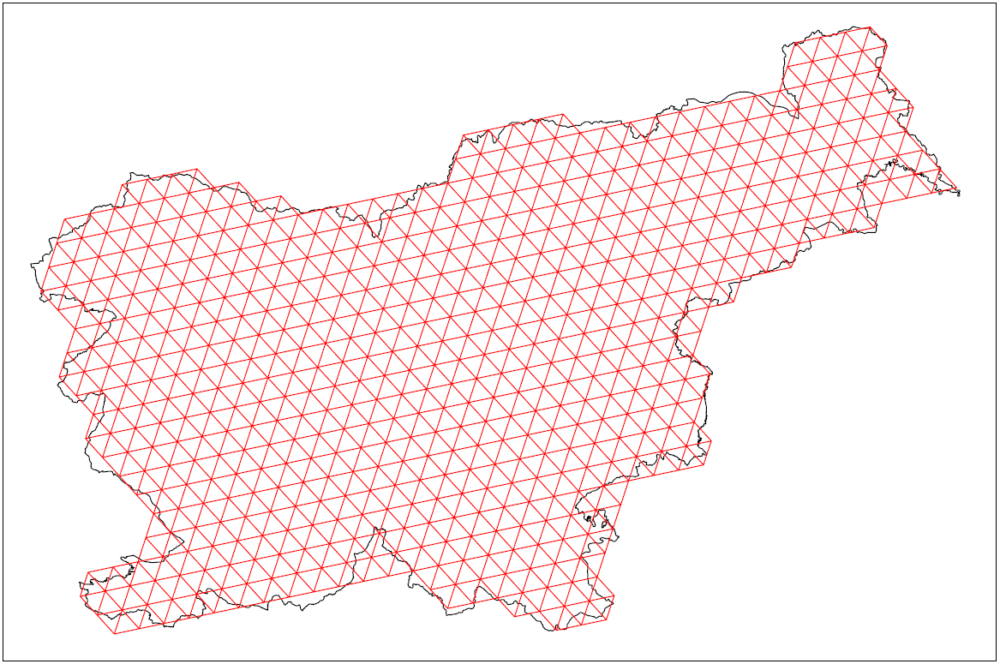
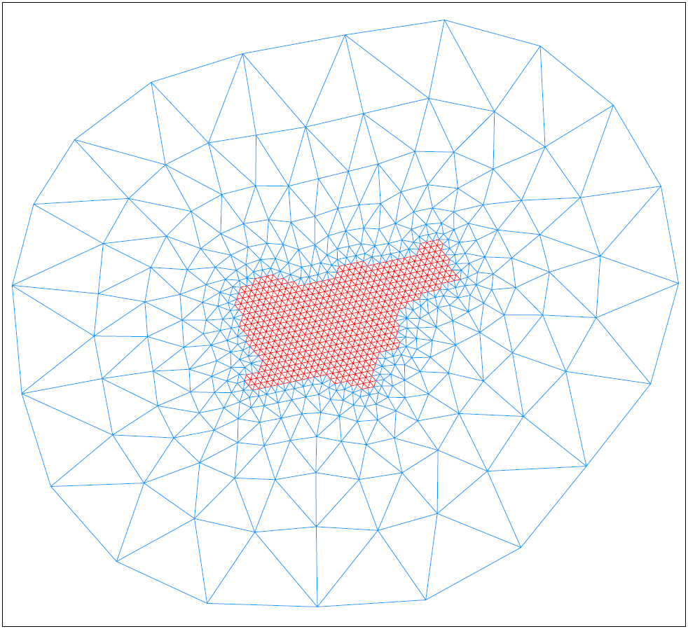

## Affine/Triangle-based Transformation
Za slovensko verzijo te datoteke glej [PREBERIME.md].

### Theory
Affine transformation only works with cartesian coordinates (GK x,y ⇔ TM x,y).
You need minimum 3 control points (for example a triangle), each with 4 coordinates
```(Xs, Ys, Xt, Yt)```, where ```Xs,Ys``` are coordinates in the source system
and ```Xt,Yt``` coordinates in the target system.

For each new point ```Xi,Yi``` transformation is calculated via the
following equation:
<pre>
Xo = a&#8270;Xi + b&#8270;Yi + c
Yo = d&#8270;Xi + e&#8270;Yi + f
</pre>
where parameters ```a..f``` have the following meaning:
<pre>
a: Scale X
e: Scale Y
d: Rotation X
b: Rotation Y
c: Translation X
f: Translation Y
</pre>
To calculate parameters ```a..f``` for a given triangle you have to solve
the system of linear equations with 6 unknowns, represented with the following
matrices:
<pre>
| Xs1 Ys1 1 0 0 0 | | a |   | Xt1 |
| Xs2 Ys2 1 0 0 0 | | b |   | Xt2 | 
| Xs3 Ys3 1 0 0 0 | | c | = | Xt3 | 
| 0 0 0 Xs1 Ys1 1 | | d |   | Yt1 | 
| 0 0 0 Xs2 Ys2 1 | | e |   | Yt2 | 
| 0 0 0 Xs3 Ys3 1 | | f |   | Yt3 |
</pre>
This system can be solved using elimination method (row operations ⇒ identity
matrix) or with other methods (Jacobi, Gauss-Seidel, ...).

### Pre-calculation
For Slovenia we have 899 reference [virtual tie points] &#40;v3.0&#41; in both
coordinate systems (GK and TM), which form 1776 triangles:




We can pre-calculate parameters ```a..f``` for every triangle and store
their values in a table to be directly used in a program.

To calculate triangles from the initial list of reference points we use
the existing program [triangle] from Jonathan Shewchuk (UCB), which generates
exact Delaunay triangulations.

#### Exact description of process
- get the reference [virtual tie points] &#40;already supplied&#41;:  
  ⇒ file ```virtualne_vezne_tocke_v3.0.txt```
- extract GK and TM coordinates from the reference file
- use [triangle] program to create triangles  
- use the supplied program ```ctt``` to create tables to be included in a program:  
  ⇒ files ```aft_gktm.h``` and ```aft_tmgk.h```  
  ```ctt``` solves the above mentioned system of linear equations for each
  triangle.

All this can be automated using the supplied scripts ```cvvt.sh``` (for Unix)
or ```cvvt.bat``` (for Windows).

### Usage in a program
For each cartesian coordinate you have to loop through the array of 1776 
pre-calculated triangles and check if the coordinate is contained in the
triangle. This check should be very accurate, otherwise you'll end up with
a point, which lies somewhere "between" the triangles (see [geo_api.md]).

When/if such triangle is found, a simple transformation using parameters
```a..f``` is applied (see **Theory** above).


[PREBERIME.md]: https://github.com/mrihtar/GeoCoordinateConverter/blob/master/aft/PREBERIME.md
[virtual tie points]: http://www.e-prostor.gov.si/si/zbirke_prostorskih_podatkov/drzavni_koordinatni_sistem/horizontalni_drzavni_koordinatni_sistem_d96tm/d96tm/transformacijski_parametri/
[triangle]: http://www.cs.cmu.edu/~quake/triangle.html
[geo_api.md]: https://github.com/mrihtar/GeoCoordinateConverter/blob/master/geo_api.md
